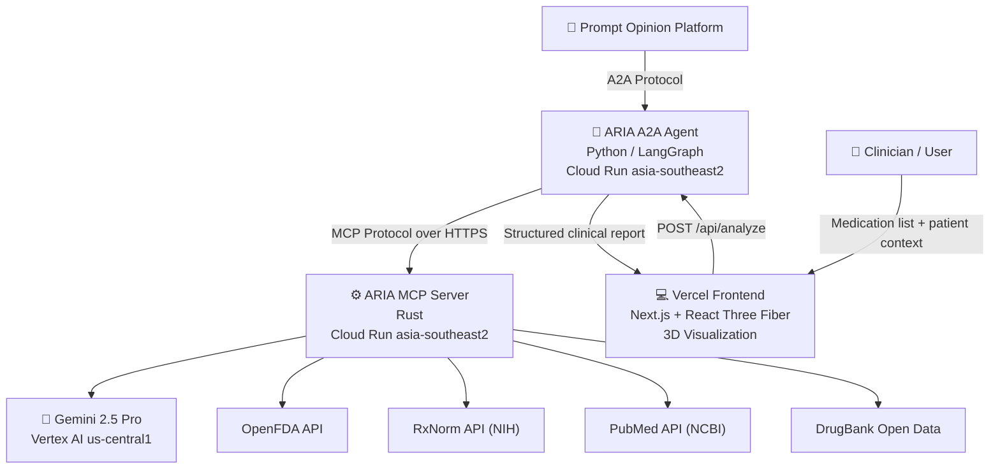
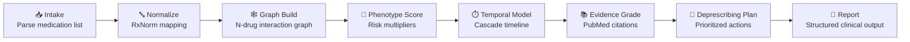
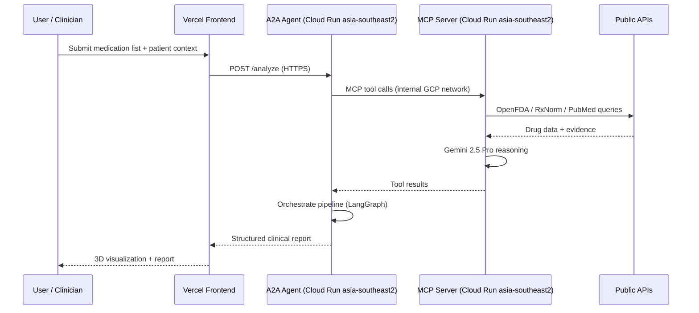
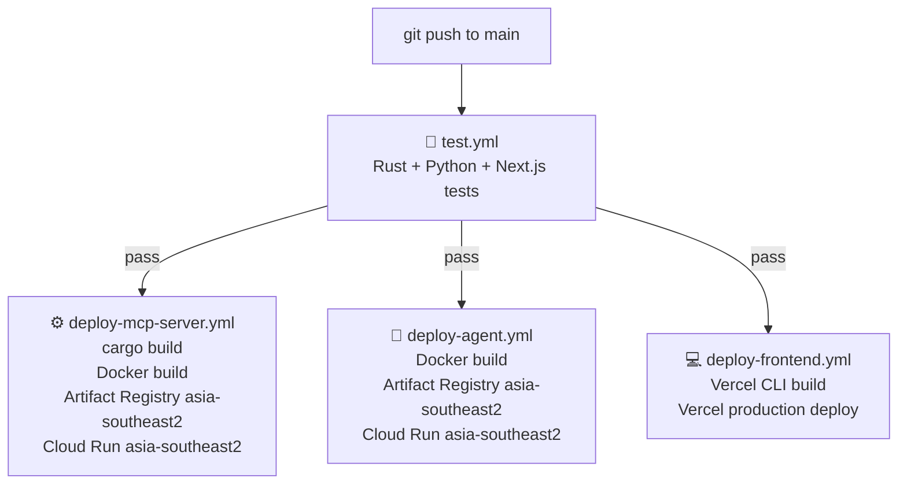
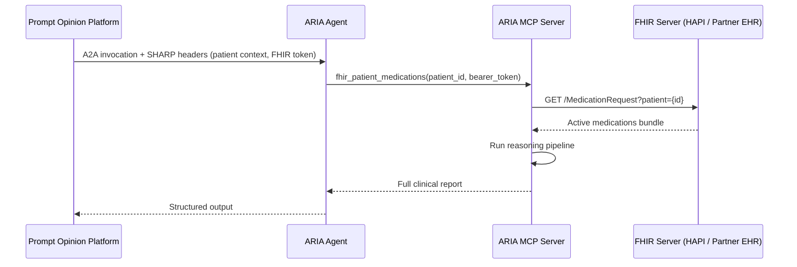

<div align="center">

# ARIA
### Adaptive Risk Intelligence for Polypharmacy Assessment

**An AI agent that does not just detect drug interactions. It reasons about them.**

[](LICENSE)
[](https://aria-mcp-server-233281205053.asia-southeast2.run.app/health)
[](https://aria-a2a-agent-233281205053.asia-southeast2.run.app/health)
[](https://aria-a2a-agent-233281205053.asia-southeast2.run.app/health)
[](https://deepmind.google/technologies/gemini/)
[](https://aria-polypharmacy.vercel.app/)
[](https://app.promptopinion.ai/marketplace/agent/019e07f1-1952-7b07-8a90-4274fdbe8b49)

[](https://medium.com/@wiqi_lee/eighteen-warnings-in-fourteen-seconds-why-i-created-aria-ffb06d1a3a13)
[](https://x.com/wiqi_lee)
[](https://youtube.com/YOUR_DEMO_LINK)

<br/>

> Clinicians override more than 90% of drug interaction alerts. Not because they are reckless, but because every existing tool delivers the same context-free noise. ARIA is the fix.

</div>

---

## Table of Contents

- [The Problem](#the-problem)
- [The Solution](#the-solution)
- [The Impact](#the-impact)
- [What Makes ARIA Different](#what-makes-aria-different)
  - [Ten Capabilities You Will Not Find Anywhere Else](#ten-capabilities-you-will-not-find-anywhere-else)
  - [Novelty Comparison](#novelty-comparison)
- [System Architecture](#system-architecture)
  - [System Overview](#system-overview)
  - [Agent Reasoning Pipeline](#agent-reasoning-pipeline)
  - [Service-to-Service Communication](#service-to-service-communication)
  - [CI/CD Pipeline](#cicd-pipeline)
- [Live Deployment](#live-deployment)
  - [Production URLs](#production-urls)
  - [Health Check Endpoints](#health-check-endpoints)
  - [Try It Live in 60 Seconds](#try-it-live-in-60-seconds)
  - [Multi-Agent Access via A2A v1.0](#multi-agent-access-via-a2a-v10)
  - [Production Deployment Stack](#production-deployment-stack)
- [Prompt Opinion Marketplace Integration](#prompt-opinion-marketplace-integration)
  - [Integration Flow](#integration-flow)
  - [SHARP Extension Specs](#sharp-extension-specs)
  - [Marketplace Listing](#marketplace-listing)
- [Project Structure](#project-structure)
- [LLM Configuration](#llm-configuration)
- [Stack](#stack)
  - [MCP Tools Exposed](#mcp-tools-exposed)
  - [Frontend Design System](#frontend-design-system)
- [Google Cloud Setup (asia-southeast2)](#google-cloud-setup-asia-southeast2)
- [CI/CD and Deployment](#cicd-and-deployment)
  - [GitHub Actions: MCP Server](#github-actions-mcp-server)
  - [GitHub Actions: A2A Agent](#github-actions-a2a-agent)
  - [GitHub Actions: Frontend (Vercel)](#github-actions-frontend-vercel)
  - [GitHub Actions: Tests](#github-actions-tests)
  - [Vercel Configuration](#vercel-configuration)
  - [Required GitHub Secrets](#required-github-secrets)
- [Getting Started (Local Development)](#getting-started-local-development)
- [Data and Privacy](#data-and-privacy)
- [Roadmap](#roadmap)
- [License](#license)
- [Built By](#built-by)

---

## The Problem

This is not an American problem. It is not a European problem. It is a global one.

Medication errors cost the world about [$42 billion every year](https://www.who.int/publications/i/item/9789240088887), close to 1% of global health spending. Half of all preventable harm in medical care is medication-related, and a quarter of those cases are severe or life-threatening. In low- and middle-income countries, the impact is roughly twice as severe in healthy life years lost. A [2025 systematic review in PLOS One](https://journals.plos.org/plosone/article?id=10.1371/journal.pone.0322392) found that Africa and Southeast Asia carry some of the highest rates of preventable medication harm in the world, made worse by pharmacies that operate without a pharmacist on site.

The driver behind a large share of this harm is **polypharmacy**, defined as taking five or more medications at the same time. Two 2024 meta-analyses put a number on it. A [review in Pharmacoepidemiology and Drug Safety](https://pubmed.ncbi.nlm.nih.gov/39135518/) found global polypharmacy prevalence among adults 60 and older at **39.1%**. An [umbrella review in Archives of Gerontology and Geriatrics](https://pubmed.ncbi.nlm.nih.gov/38733922/) covering 295 studies and nearly 60 million participants across 41 countries found general population prevalence at **37%**, rising to **52% among inpatients** and **59% among frail elderly individuals**. Polypharmacy reaches 48% in China and 49% in India ([Nature Scientific Reports, 2023](https://www.nature.com/articles/s41598-023-45095-2)) and is well documented across Southeast Asia, Indonesia included. [StatPearls (2024)](https://www.ncbi.nlm.nih.gov/books/NBK519065/) adds that medication errors are 30% more likely in patients on five or more drugs and 38% more likely in patients aged 75 and older.

The tools built to catch these interactions are static lookup tables with warning labels. They tell a clinician that Drug A and Drug B interact. They do not answer the questions that actually matter at the bedside:

- **How dangerous** is this interaction for *this specific patient*, given their age, kidney function, and clinical history?
- **When** on the clinical timeline will the risk peak?
- **Why** does this interaction occur at the biochemical level?
- **What** should the clinician do first when the patient has six conflicting interactions at once?

The result is **alert fatigue**. Clinicians see so many identical, context-free warnings that they override more than 90% of all drug interaction alerts. The tools designed to protect patients have become background noise.

No one has built a system that reasons about risk. So we did.

---

## The Solution

ARIA is not another drug interaction checker. It is a **clinical reasoning engine** built as a hybrid AI agent system that understands context, mechanism, time, and patient phenotype.

A clinician feeds ARIA a medication list and a patient context (age, sex, CKD stage, hepatic function, comorbidities). ARIA returns a structured clinical report that includes:

- A patient-specific risk score on a 0 to 10 scale, with clinical interpretation
- An N-drug interaction graph that identifies the **hub drug** causing most of the conflicts
- Three-way and emergent interactions that pairwise checkers cannot see
- A mechanistic explanation for every interaction at the CYP, renal, or microbiome level, generated by Gemini 2.5 Pro
- A temporal cascade that predicts when each risk will peak
- Cumulative burden scores for anticholinergic load, sedation, and QT prolongation
- A prioritized deprescribing plan: which drug to address first, what to substitute, what labs to monitor
- Every claim is backed by an evidence grade (A through D) and a PubMed citation

The same reasoning pipeline is exposed in three ways:

1. A **Vercel frontend** at [aria-polypharmacy.vercel.app](https://aria-polypharmacy.vercel.app) for clinicians who want the full 3D visual experience
2. An **A2A v1.0 agent** at `aria-a2a-agent-233281205053.asia-southeast2.run.app/a2a/v1` so other agents can call ARIA as a tool
3. A **Prompt Opinion Marketplace** listing where ARIA participates in multi-agent clinical workflows alongside other healthcare agents

All three paths hit the same backend, so the clinical reasoning is identical regardless of how ARIA is invoked.

---

## The Impact

| Metric | Value | Source |
|---|---|---|
| Global cost of medication errors per year | $42 billion USD | [WHO, 2024](https://www.who.int/publications/i/item/9789240088887) |
| Share of preventable medical harm that is medication-related | 50% | [WHO, 2022](https://www.who.int/news/item/16-09-2022-who-calls-for-urgent-action-by-countries-for-achieving-medication-without-harm) |
| Patients harmed by medications | 1 in 20 hospital admissions | [WHO, 2024](https://www.who.int/publications/i/item/9789240088887) |
| Global polypharmacy prevalence, general population | 37% | [Kim et al., Arch Gerontol Geriatr, 2024](https://pubmed.ncbi.nlm.nih.gov/38733922/) |
| Global polypharmacy prevalence, adults 60+ | 39.1% | [Wang et al., Pharmacoepidemiol Drug Saf, 2024](https://pubmed.ncbi.nlm.nih.gov/39135518/) |
| Polypharmacy among inpatients globally | 52% | [Kim et al., Arch Gerontol Geriatr, 2024](https://pubmed.ncbi.nlm.nih.gov/38733922/) |
| Polypharmacy in older adults, China | 48% | [Nature Scientific Reports, 2023](https://www.nature.com/articles/s41598-023-45095-2) |
| Polypharmacy in older adults, India | 49% | [Nature Scientific Reports, 2023](https://www.nature.com/articles/s41598-023-45095-2) |
| Polypharmacy in older adults, Ethiopia | 37% | [Nature Scientific Reports, 2023](https://www.nature.com/articles/s41598-023-45095-2) |
| Higher medication-error risk on 5+ drugs | 30% higher incidence | [StatPearls, 2024](https://www.ncbi.nlm.nih.gov/books/NBK519065/) |
| Drug interaction alerts overridden by clinicians | Over 90% | [Nanji et al., 2014](https://pubmed.ncbi.nlm.nih.gov/24371105/) |
| Medication-error impact in LMICs vs. high-income countries | 2x higher healthy life years lost | [WHO, 2017](https://www.who.int/news/item/29-03-2017-who-launches-global-effort-to-halve-medication-related-errors-in-5-years) |

Alert fatigue is not a behavior problem. It is a tool design problem. ARIA is the fix, built for every health system, everywhere.

---

## What Makes ARIA Different

### Ten Capabilities You Will Not Find Anywhere Else

#### 1. Temporal Cascade Modeling
Drug interactions do not all happen at once. They unfold over hours, days, and weeks. ARIA models the **timeline of risk** so a clinician knows when an interaction will actually peak and when to intervene, not just whether it exists.

#### 2. Pharmacokinetic Mechanistic Reasoning
ARIA explains *why* an interaction is dangerous at the **molecular level**: CYP enzyme competition, renal clearance conflicts, protein binding displacement, gut microbiome interference. Gemini 2.5 Pro does the reasoning, not a heuristic lookup.

#### 3. Patient Phenotype Risk Multiplier
The same drug pair carries very different risk profiles in different patients. ARIA produces a **personalized risk score** adjusted for age, sex, CKD stage, hepatic function, smoking status, and more.

```
Warfarin + Aspirin in a healthy 35-year-old male    ->  4.2 / 10
Warfarin + Aspirin in a 72-year-old female, CKD 3   ->  9.1 / 10
```

#### 4. N-Drug Interaction Graph with Hub Identification
Pairwise checkers do not scale. A patient on eight drugs generates 28 pairwise checks, which is overwhelming noise. ARIA builds a full **interaction graph**, identifies the **hub drug** that causes the majority of conflicts, and detects **three-drug emergent interactions** that pairwise logic cannot see.

```
Example: Aspirin + Warfarin + Fish Oil
Each one alone is manageable.
Together they create a triple anticoagulant effect.
No pairwise checker catches this.
```

#### 5. Evidence Grading with Confidence Scores
Every alert is tagged with an **evidence grade** (A through D) and a **confidence score** (0 to 100%), with auto-linked PubMed citations. Clinicians can triage by evidence quality instead of treating every alert as equally urgent.

#### 6. Cumulative Burden Scores
ARIA computes aggregate clinical loads across all medications at once: **anticholinergic burden**, **sedation load**, and **QT prolongation risk**. These are validated clinical metrics that no existing tool surfaces as agent output.

#### 7. Deprescribing Optimizer
ARIA returns a **prioritized, actionable deprescribing plan**: which drug to address first, what to substitute, which labs to monitor, and the expected risk reduction at each step. Not a warning. A plan.

#### 8. All of the Above, Integrated
None of these are isolated features. ARIA's A2A agent runs them as one coherent reasoning pipeline. From a raw medication list to a structured clinical report, in a single invocation.

#### 9. Exportable Clinical Reports
ARIA generates publication-ready reports in three formats: **interactive 3D web view**, **downloadable HTML**, and **PDF** (via browser print). Each report includes risk interpretation, per-interaction PubMed citations, and a 3D patient body scan visualization. All timestamps use **WIB (Jakarta time)** for Southeast Asian clinical workflows.

#### 10. FHIR-Native Patient Context Ingestion
ARIA reads active medications directly from any FHIR R4 EHR via the `fhir_patient_medications` MCP tool. When invoked inside Prompt Opinion, patient IDs and bearer tokens propagate automatically through the SHARP Extension Specs. No manual entry, no custom EHR integration. For standalone use, the public HAPI FHIR sandbox serves as the test endpoint.

```
Prompt Opinion sends patient context
  -> ARIA FHIR tool queries EHR
  -> MedicationRequest bundle
  -> ARIA analyzes interactions

Zero manual data entry. End-to-end in one agent call.
```

### Novelty Comparison

| Capability | Existing Tools | ARIA |
|-----------|---------------|------|
| Pairwise drug interaction lookup | Drugs.com, Epocrates, Medscape | Yes |
| Three-way and N-drug emergent interactions | None | Yes |
| Temporal cascade modeling | None | Yes |
| Mechanistic reasoning via CYP, renal, microbiome pathways | None as agent | Yes |
| Patient phenotype risk multiplier | None | Yes |
| Evidence grading with confidence score per alert | None | Yes |
| Cumulative burden scores as agent output | None | Yes |
| Prioritized deprescribing optimizer | None | Yes |
| 3D interactive clinical report with export (PDF/HTML) | None | Yes |
| 3D patient body scan visualization | None | Yes |
| Risk score interpretation with clinical context (0 to 10 scale) | None | Yes |

---

## System Architecture

### System Overview



### Agent Reasoning Pipeline



### Service-to-Service Communication



### CI/CD Pipeline



---

## Live Deployment

ARIA is fully deployed and accessible to judges and reviewers right now. Every endpoint below is public and does not require authentication for read access.

### Production URLs

| Component | Base URL | Health Check | Status |
|---|---|---|---|
| **Marketplace Listing (Prompt Opinion)** | [View ARIA on Prompt Opinion](https://app.promptopinion.ai/marketplace/agent/019e07f1-1952-7b07-8a90-4274fdbe8b49) | (n/a) | Published |
| **Frontend (Vercel)** | [aria-polypharmacy.vercel.app](https://aria-polypharmacy.vercel.app) | (n/a) | Live |
| **A2A Agent (Cloud Run)** | [aria-a2a-agent-233281205053.asia-southeast2.run.app](https://aria-a2a-agent-233281205053.asia-southeast2.run.app) | [`/health`](https://aria-a2a-agent-233281205053.asia-southeast2.run.app/health) | Live |
| **MCP Server (Cloud Run)** | [aria-mcp-server-233281205053.asia-southeast2.run.app](https://aria-mcp-server-233281205053.asia-southeast2.run.app) | [`/health`](https://aria-mcp-server-233281205053.asia-southeast2.run.app/health) | Live |

| Setting | Value |
|---|---|
| **GCP Project** | `aria-2026-ai` (project number `233281205053`) |
| **Cloud Run Region** | `asia-southeast2` (Jakarta), A2A Agent and MCP Server |
| **Vertex AI Region** | `us-central1`, Gemini 2.5 Pro calls only |

> **Note.** The links in the **Health Check** column return the canonical JSON health payload expected by judges and uptime monitors. The base URLs are shown for reference (for example, as `PUBLIC_AGENT_URL` in client configuration); they are not intended to be opened in a browser.

### Health Check Endpoints

Judges can verify the deployment is live by hitting these public endpoints:

```bash
# Frontend
curl -I https://aria-polypharmacy.vercel.app
# Expected: HTTP/2 200

# A2A Agent (Python LangGraph orchestrator)
curl https://aria-a2a-agent-233281205053.asia-southeast2.run.app/health
# Expected: {"status":"healthy","service":"aria-agent","mcp_server":"connected", ...}

# MCP Server (Rust drug knowledge backend)
curl https://aria-mcp-server-233281205053.asia-southeast2.run.app/health
# Expected: {"service":"aria-mcp-server","status":"healthy","version":"0.1.0"}
```

### Try It Live in 60 Seconds

1. Open https://aria-polypharmacy.vercel.app/analyze
2. Click any **Quick Test** preset:
   - **72F CKD3** returns risk score **9.6 CRITICAL**
   - **81M Cardiac** returns **8.3 HIGH**
   - **65F Anticholinergic Burden** returns **8.4 HIGH**
3. Wait about 10 seconds while the LangGraph agent orchestrates Gemini 2.5 Pro reasoning over Vertex AI
4. View the rendered 3D interaction graph, phenotype radar, deprescribing waterfall, and exportable PDF clinical report

### Multi-Agent Access via A2A v1.0

ARIA is also exposed as a first-class agent in the Agent2Agent (A2A) v1.0 ecosystem, so other AI agents can call it as a tool without going through the web UI. The A2A Agent publishes its capabilities at `/.well-known/agent-card.json` for automatic discovery, and serves a JSON-RPC 2.0 endpoint at `/a2a/v1` that conforms to the official A2A v1.0 specification.

ARIA can be consumed two ways depending on the use case:

| Path | Best for | URL |
|---|---|---|
| **Vercel frontend** | Clinicians, judges, end users who want the full visual experience (3D phenotype graph, risk timeline, deprescribing waterfall, PDF export) | https://aria-polypharmacy.vercel.app |
| **A2A protocol** | Other agents and orchestration platforms that want to invoke ARIA as a polypharmacy reasoning tool | https://aria-a2a-agent-233281205053.asia-southeast2.run.app/a2a/v1 |

Both paths hit the same backend pipeline (LangGraph orchestrator over MCP Server over Vertex AI), so the clinical reasoning is identical.

#### Verified Interoperability with Prompt Opinion

ARIA has been tested and confirmed working as a connected agent inside [Prompt Opinion](https://promptopinion.ai), a multi-agent collaboration platform. From a Prompt Opinion conversation, an orchestrator agent can delegate a polypharmacy question to ARIA, receive the full structured analysis, and surface it back to the user in the same chat. This confirms that ARIA is interoperable with the broader A2A v1.0 ecosystem and not just its own frontend.

For maximum cross-client compatibility, the JSON-RPC endpoint accepts both the official spec method names (`message/send`, `tasks/send`) and the PascalCase variants emitted by some clients (`SendMessage`, `sendMessage`).

#### Quick A2A Smoke Test

```bash
curl -s -X POST https://aria-a2a-agent-233281205053.asia-southeast2.run.app/a2a/v1 \
  -H "Content-Type: application/json" \
  -d '{
    "jsonrpc":"2.0","id":"demo-1","method":"message/send",
    "params":{"message":{"role":"ROLE_USER","messageId":"m1",
    "parts":[{"text":"{\"medications\":[\"warfarin\",\"aspirin\"],\"patient\":{\"age\":78,\"sex\":\"male\",\"ckd_stage\":3}}"}]}}
  }' | python3 -m json.tool | head -20
```

Expected response: a JSON-RPC envelope where `result.task.status.state` is `"TASK_STATE_COMPLETED"` and `result.task.artifacts[0]` is the `aria-analysis` artifact containing the full structured polypharmacy report. The response is wrapped in the v1.0 `{"task": {...}}` envelope per the official A2A specification; legacy v0.3-style requests (with `"role": "user"` and `"kind": "text"` on parts) are also accepted for backward compatibility.

### Production Deployment Stack

- **LLM**: Gemini 2.5 Pro via Vertex AI in `us-central1` (no API keys, uses GCP IAM)
- **Authentication**: Default compute service account with `roles/aiplatform.user` and `roles/secretmanager.secretAccessor`
- **Secrets**: OpenFDA API key stored in GCP Secret Manager, mounted into the Agent at runtime as `OPENFDA_API_KEY`
- **Container Registry**: Artifact Registry at `asia-southeast2-docker.pkg.dev/aria-2026-ai/aria-images`
- **Frontend**: Next.js 15 on Vercel with `NEXT_PUBLIC_AGENT_URL` pointing to the Cloud Run agent
- **CI/CD**: GitHub Actions workflows in `.github/workflows/` auto-deploy on push to `main`

> **Note on Vertex AI region.** Cloud Run services live in `asia-southeast2` (Jakarta) for low latency to Southeast Asian users, while Vertex AI calls go to `us-central1` because Gemini 2.5 Pro is not yet available in `asia-southeast2`. The added cross-region latency is roughly 200 ms per call, which is acceptable for the deliberative, non-interactive reasoning ARIA performs.

---

## Prompt Opinion Marketplace Integration

ARIA is published to the [Prompt Opinion Marketplace](https://app.promptopinion.ai) as part of the [Agents Assemble Hackathon](https://agents-assemble.devpost.com). The integration follows **Path B (A2A Agent)** as defined in the competition rules.

### Integration Flow



### SHARP Extension Specs

Patient context (patient ID) and FHIR bearer tokens propagate through multi-agent call chains via Prompt Opinion's SHARP Extension headers. ARIA's FHIR tool accepts both the platform-provided token and a local fallback for standalone testing. See [`docs/sharp-integration.md`](docs/sharp-integration.md) for header names, token propagation rules, and fallback behavior.

### Marketplace Listing

ARIA is published on the Prompt Opinion Marketplace as **ARIA Polypharmacy Specialist** by Wiqi Labs.

**Direct link:** [https://app.promptopinion.ai/marketplace/agent/019e07f1-1952-7b07-8a90-4274fdbe8b49](https://app.promptopinion.ai/marketplace/agent/019e07f1-1952-7b07-8a90-4274fdbe8b49)

From the listing page, judges and reviewers can:

- View the full agent card, skills, extensions, and technical specs
- Copy the A2A Agent Card URL for direct A2A invocation
- Click **Add to Workspace** to install ARIA into a Prompt Opinion workspace and consult it from any conversation

---

## Project Structure

```
ARIA/
│
├── .github/
│   ├── workflows/
│   │   ├── deploy-mcp-server.yml       # CI/CD: Rust build and deploy to Cloud Run (asia-southeast2)
│   │   ├── deploy-agent.yml            # CI/CD: Python build and deploy to Cloud Run (asia-southeast2)
│   │   ├── deploy-frontend.yml         # CI/CD: Vercel deploy on push to main
│   │   └── test.yml                    # CI: Run all tests on every PR
│   └── PULL_REQUEST_TEMPLATE.md        # Standard PR description template
│
├── mcp-server/                         # Rust MCP Server (Google Cloud Run)
│   ├── src/
│   │   ├── main.rs                     # Server entrypoint, MCP protocol handler
│   │   ├── tools/
│   │   │   ├── mod.rs                  # Tool registry
│   │   │   ├── check_interactions.rs   # Core interaction detection
│   │   │   ├── explain_mechanism.rs    # CYP pathway mechanistic reasoning (Gemini 2.5 Pro)
│   │   │   ├── score_risk.rs           # Patient phenotype risk multiplier
│   │   │   ├── suggest_alternatives.rs # Evidence-based substitution suggestions
│   │   │   ├── interaction_graph.rs    # N-drug graph with hub identification
│   │   │   ├── burden_scores.rs        # Anticholinergic, sedation, QT burden
│   │   │   ├── temporal_cascade.rs     # Timeline risk cascade modeling
│   │   │   ├── deprescribing_plan.rs   # Prioritized deprescribing optimizer
│   │   │   ├── fhir_patient_medications.rs # FHIR R4 medication ingestion (HAPI / partner EHR)
│   │   │   └── generate_report.rs      # Structured clinical report output
│   │   ├── api/
│   │   │   ├── openfda.rs              # OpenFDA API client
│   │   │   ├── rxnorm.rs               # RxNorm NIH API client
│   │   │   ├── pubmed.rs               # PubMed evidence citation client
│   │   │   ├── drugbank.rs             # DrugBank Open Data client
│   │   │   ├── fhir.rs                 # FHIR R4 client (HAPI sandbox / partner EHR)
│   │   │   └── gemini.rs               # Gemini 2.5 Pro client (Vertex AI + AI Studio dual-mode)
│   │   ├── models/
│   │   │   ├── drug.rs                 # Drug struct and normalization
│   │   │   ├── patient.rs              # PatientContext and phenotype fields
│   │   │   ├── interaction.rs          # Interaction report types
│   │   │   └── risk.rs                 # RiskScore, BurdenScores, CascadeModel
│   │   └── llm/
│   │       ├── mod.rs                  # LLM client abstraction layer
│   │       └── reasoning.rs            # All Gemini 2.5 Pro prompt templates
│   ├── Cargo.toml
│   ├── Dockerfile                      # Multi-stage Rust build for Cloud Run
│   └── .env.example
│
├── agent/                              # Python A2A Agent (Google Cloud Run)
│   ├── src/
│   │   ├── main.py                     # Agent entrypoint, FastAPI + A2A handler
│   │   ├── pipeline/
│   │   │   ├── __init__.py
│   │   │   ├── graph.py                # LangGraph state machine definition
│   │   │   ├── intake.py               # Medication list and context parser
│   │   │   ├── normalize.py            # RxNorm drug normalization step
│   │   │   ├── graph_builder.py        # Interaction graph construction step
│   │   │   ├── phenotype_scorer.py     # Risk multiplier application step
│   │   │   ├── temporal_modeler.py     # Cascade timeline projection step
│   │   │   ├── evidence_grader.py      # PubMed evidence attachment step
│   │   │   ├── plan_generator.py       # Deprescribing plan generation step
│   │   │   └── report_builder.py       # Final structured report assembly step
│   │   ├── mcp_client/
│   │   │   ├── client.py               # Async HTTP MCP client
│   │   │   └── schema.py               # Pydantic models for all tool I/O
│   │   └── synthetic/
│   │       ├── generator.py            # Synthetic patient data generator
│   │       └── fixtures/
│   │           ├── patients.json       # 10 sample synthetic patient profiles
│   │           └── medications.json    # 50 sample medication lists
│   ├── requirements.txt
│   ├── Dockerfile                      # Google Cloud Run container
│   └── .env.example
│
├── frontend/                           # Vercel Frontend (Next.js + React Three Fiber + Framer Motion)
│   ├── src/
│   │   ├── app/
│   │   │   ├── layout.tsx              # Root layout, fonts, global providers
│   │   │   ├── page.tsx                # Landing / hero page
│   │   │   ├── globals.css             # CSS variables, base styles, dark theme
│   │   │   ├── analyze/
│   │   │   │   └── page.tsx            # Patient input and analysis page
│   │   │   ├── report/
│   │   │   │   └── page.tsx            # Full clinical report with 3D viz, PDF/HTML export, risk interpretation
│   │   │   ├── about/
│   │   │   │   └── page.tsx            # About page: problem, solution, capabilities, usage, credits
│   │   │   └── api/
│   │   │       └── analyze/
│   │   │           └── route.ts        # Next.js API route, proxies to agent
│   │   ├── components/
│   │   │   ├── ui/                     # shadcn/ui base components
│   │   │   ├── layout/
│   │   │   │   ├── Navbar.tsx          # Top navigation with animated logo (Home, Analyze, Report, About)
│   │   │   │   └── PageTransition.tsx  # Framer Motion page transitions
│   │   │   ├── 3d/
│   │   │   │   ├── Scene.tsx           # React Three Fiber Canvas wrapper
│   │   │   │   ├── HeroBackground.tsx  # Animated 3D hero background
│   │   │   │   ├── FloatingParticles.tsx     # Ambient molecule / particle field
│   │   │   │   ├── InteractionGraph3D.tsx    # Force-directed drug interaction graph with hub detection
│   │   │   │   ├── TemporalTimeline3D.tsx    # Animated 3D risk timeline with intervention windows
│   │   │   │   ├── PhenotypeRadar3D.tsx      # 3D radar chart with zoom/rotate, per-axis interpretation
│   │   │   │   ├── DeprescribingWaterfall.tsx # Risk reduction waterfall with priority ordering
│   │   │   │   └── PatientAvatar3D.tsx       # 3D patient body with scan animation and auto-rotate
│   │   │   ├── effects/
│   │   │   │   ├── CustomCursor.tsx    # Global custom cursor with trail effect
│   │   │   │   ├── ParticleField.tsx   # Page-level ambient particles
│   │   │   │   ├── GridBackground.tsx  # Subtle animated grid lines
│   │   │   │   └── DataStream.tsx      # Corner data stream / matrix effect
│   │   │   ├── forms/
│   │   │   │   ├── PatientForm.tsx     # Medication list and patient context
│   │   │   │   ├── DrugInput.tsx       # Single drug entry with autocomplete
│   │   │   │   └── PatientContextForm.tsx    # Age, sex, CKD stage, comorbidities
│   │   │   ├── report/
│   │   │   │   ├── RiskReport.tsx      # Structured report with burden scores, interactions, deprescribing, citations
│   │   │   │   ├── InteractionCard.tsx # Single interaction detail card
│   │   │   │   ├── EvidenceBadge.tsx   # A/B/C/D evidence grade badge
│   │   │   │   ├── SeverityMeter.tsx   # Animated 0-10 risk meter
│   │   │   │   └── DeprescribingStep.tsx # Single step in deprescribing plan
│   │   │   └── ui/
│   │   │       ├── GlowCard.tsx        # Card with hover glow border
│   │   │       ├── GradientButton.tsx  # Button with animated gradient
│   │   │       └── LoadingScreen.tsx   # Full-screen ARIA loader
│   │   └── lib/
│   │       ├── api.ts                  # Typed frontend API client
│   │       ├── types.ts                # Shared TypeScript types
│   │       ├── theme.ts                # Color tokens, design system constants
│   │       └── fonts.ts                # Typography configuration
│   ├── public/
│   │   └── logo/
│   │       └── favicon.ico
│   ├── next.config.ts
│   ├── tailwind.config.ts              # Custom dark theme, color tokens
│   ├── vercel.json                     # Vercel config with env var mappings
│   ├── tsconfig.json
│   └── package.json
│
├── docs/
│   ├── setup.md                        # Full local setup guide
│   ├── architecture.md                 # System architecture deep dive
│   ├── api-reference.md                # MCP tool API reference
│   └── synthetic-data.md               # Synthetic data schema reference
│
├── .gitignore                          # Rust, Python, Node, env files
├── .env.example                        # Root env var reference
├── docker-compose.yml                  # Local full-stack dev environment
├── LICENSE                             # MIT License
└── README.md
```

---

## LLM Configuration

ARIA supports two Gemini auth modes selected at runtime via the `LLM_MODE` environment variable:

| Mode | Auth Method | Use Case |
|------|------------|----------|
| `vertex_ai` (default) | GCP IAM + service account | Production with enterprise access control |
| `ai_studio` | Google AI Studio API key | Hackathon demos, lightweight external integrations |

Prompt logic is identical across both modes. Only the HTTP endpoint and auth header change. The switch is a single function in [`mcp-server/src/api/gemini.rs`](mcp-server/src/api/gemini.rs). Production deployments use `vertex_ai` by default. The Prompt Opinion marketplace integration uses `ai_studio` for the free-tier onboarding flow during connection verification.

```bash
# Production (default)
LLM_MODE=vertex_ai
GOOGLE_CLOUD_PROJECT=your-gcp-project-id
VERTEXAI_LOCATION=us-central1   # Gemini 2.5 Pro is not yet available in asia-southeast2

# Hackathon / external platform integration
LLM_MODE=ai_studio
GOOGLE_AI_STUDIO_API_KEY=AIza...
```

---

## Stack

| Layer | Technology | Region |
|-------|-----------|--------|
| MCP Server | Rust | Google Cloud Run (`asia-southeast2`) |
| A2A Agent | Python + LangGraph | Google Cloud Run (`asia-southeast2`) |
| LLM Reasoning | Gemini 2.5 Pro (Vertex AI) | `us-central1` |
| Container Registry | Google Artifact Registry | `asia-southeast2` |
| Frontend | Next.js 14 + React Three Fiber + Framer Motion | Vercel Edge Network |
| 3D Rendering | React Three Fiber + Drei + Postprocessing | Client-side |
| 3D Visualizations | Force-directed graph, temporal timeline, phenotype radar, deprescribing waterfall, patient body scan | Client-side |
| Report Export | PDF (browser print), HTML download, interactive web view | Client-side |
| UI Components | shadcn/ui + Tailwind CSS | Client-side |
| Timezone | Asia/Jakarta (WIB) | Client-side |
| Drug Normalization | RxNorm API (NIH) | External |
| Interaction Data | OpenFDA, DrugBank Open | External |
| Evidence Layer | PubMed API (NCBI) | External |
| Patient Context Ingestion | FHIR R4 (HAPI sandbox / partner EHR via SHARP) | External |
| Patient Data | 100% synthetic, no PHI | Local generation |

### MCP Tools Exposed

```rust
check_interactions(drugs: Vec<Drug>, context: PatientContext)         -> InteractionReport
explain_mechanism(drug_a: Drug, drug_b: Drug)                         -> MechanisticExplanation
score_risk(interaction: Interaction, phenotype: PatientPhenotype)     -> RiskScore
suggest_alternatives(drug: Drug, reason: String, ctx: PatientContext) -> Alternatives
build_interaction_graph(drugs: Vec<Drug>)                             -> InteractionGraph
compute_burden_scores(drugs: Vec<Drug>)                               -> BurdenScores
model_temporal_cascade(drugs: Vec<Drug>, timeline: Timeline)          -> CascadeModel
generate_deprescribing_plan(analysis: FullAnalysis)                   -> DeprescribingPlan
generate_report(analysis: FullAnalysis)                               -> ClinicalReport
fhir_patient_medications(patient_id: String, bearer: Option<String>)  -> FhirMedicationList
```

### Frontend Design System

```
Background:   #020817   deep navy black
Surface:      #0f172a   card backgrounds
Border:       #1e3a5f   subtle borders
Primary:      #06b6d4   cyan, main interactive color
Secondary:    #8b5cf6   purple, accent
Danger:       #ef4444   red, critical warnings
Warning:      #f59e0b   amber, moderate warnings
Success:      #10b981   green, safe interactions
Text:         #f1f5f9   primary text
Muted:        #64748b   secondary text

Fonts:
  Display:  Space Grotesk (headings, logo)
  Body:     Inter (paragraph, UI text)
  Mono:     JetBrains Mono (drug names, values, codes)
```

---

## Google Cloud Setup (asia-southeast2)

All backend services run on Google Cloud Run in the `asia-southeast2` region. This minimizes latency for Southeast Asian users and keeps data residency within the region.

### 1. Initial GCP Project Setup

```bash
gcloud init
gcloud config set project YOUR_PROJECT_ID
gcloud config set run/region asia-southeast2
gcloud config set artifacts/location asia-southeast2

gcloud services enable \
  run.googleapis.com \
  artifactregistry.googleapis.com \
  cloudbuild.googleapis.com \
  secretmanager.googleapis.com \
  iam.googleapis.com \
  aiplatform.googleapis.com
```

### 2. Create Artifact Registry (asia-southeast2)

```bash
gcloud artifacts repositories create aria-repo \
  --repository-format=docker \
  --location=asia-southeast2 \
  --description="ARIA container images"

gcloud auth configure-docker asia-southeast2-docker.pkg.dev
```

Your image URLs will follow this format:

```
asia-southeast2-docker.pkg.dev/YOUR_PROJECT_ID/aria-repo/aria-mcp-server:latest
asia-southeast2-docker.pkg.dev/YOUR_PROJECT_ID/aria-repo/aria-agent:latest
```

### 3. Create a Service Account for CI/CD

```bash
gcloud iam service-accounts create aria-cicd \
  --display-name="ARIA CI/CD Service Account"

gcloud projects add-iam-policy-binding YOUR_PROJECT_ID \
  --member="serviceAccount:aria-cicd@YOUR_PROJECT_ID.iam.gserviceaccount.com" \
  --role="roles/run.admin"

gcloud projects add-iam-policy-binding YOUR_PROJECT_ID \
  --member="serviceAccount:aria-cicd@YOUR_PROJECT_ID.iam.gserviceaccount.com" \
  --role="roles/artifactregistry.writer"

gcloud projects add-iam-policy-binding YOUR_PROJECT_ID \
  --member="serviceAccount:aria-cicd@YOUR_PROJECT_ID.iam.gserviceaccount.com" \
  --role="roles/cloudbuild.builds.editor"

gcloud projects add-iam-policy-binding YOUR_PROJECT_ID \
  --member="serviceAccount:aria-cicd@YOUR_PROJECT_ID.iam.gserviceaccount.com" \
  --role="roles/iam.serviceAccountUser"

gcloud projects add-iam-policy-binding YOUR_PROJECT_ID \
  --member="serviceAccount:aria-cicd@YOUR_PROJECT_ID.iam.gserviceaccount.com" \
  --role="roles/aiplatform.user"

gcloud iam service-accounts keys create gcp-sa-key.json \
  --iam-account=aria-cicd@YOUR_PROJECT_ID.iam.gserviceaccount.com
```

Copy the contents of `gcp-sa-key.json` into the `GCP_SA_KEY` GitHub Secret, then delete it locally:

```bash
rm gcp-sa-key.json
```

### 4. Store Secrets in GCP Secret Manager

```bash
echo -n "YOUR_OPENFDA_API_KEY" | \
  gcloud secrets create openfda-api-key --data-file=-

# Gemini 2.5 Pro runs via Vertex AI.
# No separate API key needed. Access is controlled by IAM roles above.

gcloud secrets add-iam-policy-binding openfda-api-key \
  --member="serviceAccount:aria-cicd@YOUR_PROJECT_ID.iam.gserviceaccount.com" \
  --role="roles/secretmanager.secretAccessor"
```

### 5. Deploy MCP Server to Cloud Run (asia-southeast2)

```bash
docker build -t asia-southeast2-docker.pkg.dev/YOUR_PROJECT_ID/aria-repo/aria-mcp-server:latest ./mcp-server
docker push asia-southeast2-docker.pkg.dev/YOUR_PROJECT_ID/aria-repo/aria-mcp-server:latest

gcloud run deploy aria-mcp-server \
  --image asia-southeast2-docker.pkg.dev/YOUR_PROJECT_ID/aria-repo/aria-mcp-server:latest \
  --region asia-southeast2 \
  --platform managed \
  --allow-unauthenticated \
  --memory 512Mi \
  --cpu 1 \
  --min-instances 0 \
  --max-instances 10 \
  --set-env-vars LLM_MODE=vertex_ai,GOOGLE_CLOUD_PROJECT=YOUR_PROJECT_ID,VERTEXAI_LOCATION=us-central1,GEMINI_MODEL=gemini-2.5-pro,FHIR_BASE_URL=https://hapi.fhir.org/baseR4 \
  --set-secrets OPENFDA_API_KEY=openfda-api-key:latest
```

### 6. Deploy A2A Agent to Cloud Run (asia-southeast2)

```bash
docker build -t asia-southeast2-docker.pkg.dev/YOUR_PROJECT_ID/aria-repo/aria-agent:latest ./agent
docker push asia-southeast2-docker.pkg.dev/YOUR_PROJECT_ID/aria-repo/aria-agent:latest

MCP_SERVER_URL=$(gcloud run services describe aria-mcp-server \
  --region asia-southeast2 \
  --format='value(status.url)')

gcloud run deploy aria-agent \
  --image asia-southeast2-docker.pkg.dev/YOUR_PROJECT_ID/aria-repo/aria-agent:latest \
  --region asia-southeast2 \
  --platform managed \
  --allow-unauthenticated \
  --memory 1Gi \
  --cpu 1 \
  --min-instances 0 \
  --max-instances 10 \
  --set-env-vars MCP_SERVER_URL=$MCP_SERVER_URL,GOOGLE_CLOUD_PROJECT=YOUR_PROJECT_ID,VERTEXAI_LOCATION=us-central1,GEMINI_MODEL=gemini-2.5-pro
```

### 7. Service-to-Service Communication

The A2A Agent calls the MCP Server over HTTPS within the same GCP project. Traffic stays inside Google's internal network and does not incur egress charges.

```
[A2A Agent: Cloud Run asia-southeast2]
          |
          | HTTPS (internal GCP network)
          v
[MCP Server: Cloud Run asia-southeast2]
```

To lock down the MCP Server so only the agent can call it (recommended for production):

```bash
gcloud run deploy aria-mcp-server \
  --image ... \
  --region asia-southeast2 \
  --no-allow-unauthenticated

gcloud run services add-iam-policy-binding aria-mcp-server \
  --region asia-southeast2 \
  --member="serviceAccount:aria-agent-sa@YOUR_PROJECT_ID.iam.gserviceaccount.com" \
  --role="roles/run.invoker"
```

---

## CI/CD and Deployment

### GitHub Actions: MCP Server

```yaml
# .github/workflows/deploy-mcp-server.yml
name: Deploy MCP Server

on:
  push:
    branches: [main]
    paths: [mcp-server/**]

env:
  REGION: asia-southeast2
  IMAGE: asia-southeast2-docker.pkg.dev/${{ secrets.GCP_PROJECT_ID }}/aria-repo/aria-mcp-server

jobs:
  deploy:
    runs-on: ubuntu-latest
    steps:
      - uses: actions/checkout@v4

      - name: Authenticate to Google Cloud
        uses: google-github-actions/auth@v2
        with:
          credentials_json: ${{ secrets.GCP_SA_KEY }}

      - name: Set up Cloud SDK
        uses: google-github-actions/setup-gcloud@v2

      - name: Configure Docker for Artifact Registry
        run: gcloud auth configure-docker asia-southeast2-docker.pkg.dev

      - name: Build and push Docker image
        run: |
          docker build -t $IMAGE:${{ github.sha }} ./mcp-server
          docker push $IMAGE:${{ github.sha }}

      - name: Deploy to Cloud Run asia-southeast2
        run: |
          gcloud run deploy aria-mcp-server \
            --image $IMAGE:${{ github.sha }} \
            --region $REGION \
            --platform managed \
            --allow-unauthenticated \
            --memory 512Mi \
            --cpu 1 \
            --set-env-vars LLM_MODE=vertex_ai,GOOGLE_CLOUD_PROJECT=${{ secrets.GCP_PROJECT_ID }},VERTEXAI_LOCATION=us-central1,GEMINI_MODEL=gemini-2.5-pro,FHIR_BASE_URL=https://hapi.fhir.org/baseR4 \
            --set-secrets OPENFDA_API_KEY=openfda-api-key:latest
```

### GitHub Actions: A2A Agent

```yaml
# .github/workflows/deploy-agent.yml
name: Deploy A2A Agent

on:
  push:
    branches: [main]
    paths: [agent/**]

env:
  REGION: asia-southeast2
  IMAGE: asia-southeast2-docker.pkg.dev/${{ secrets.GCP_PROJECT_ID }}/aria-repo/aria-agent

jobs:
  deploy:
    runs-on: ubuntu-latest
    steps:
      - uses: actions/checkout@v4

      - name: Authenticate to Google Cloud
        uses: google-github-actions/auth@v2
        with:
          credentials_json: ${{ secrets.GCP_SA_KEY }}

      - name: Set up Cloud SDK
        uses: google-github-actions/setup-gcloud@v2

      - name: Configure Docker for Artifact Registry
        run: gcloud auth configure-docker asia-southeast2-docker.pkg.dev

      - name: Build and push Docker image
        run: |
          docker build -t $IMAGE:${{ github.sha }} ./agent
          docker push $IMAGE:${{ github.sha }}

      - name: Deploy to Cloud Run asia-southeast2
        run: |
          gcloud run deploy aria-agent \
            --image $IMAGE:${{ github.sha }} \
            --region $REGION \
            --platform managed \
            --allow-unauthenticated \
            --memory 1Gi \
            --cpu 1 \
            --port 8000 \
            --set-env-vars MCP_SERVER_URL=${{ secrets.MCP_SERVER_URL }},PUBLIC_AGENT_URL=${{ secrets.PUBLIC_AGENT_URL }},GOOGLE_CLOUD_PROJECT=${{ secrets.GCP_PROJECT_ID }},VERTEXAI_LOCATION=us-central1,GEMINI_MODEL=gemini-2.5-pro
```

### GitHub Actions: Frontend (Vercel)

```yaml
# .github/workflows/deploy-frontend.yml
name: Deploy Frontend

on:
  push:
    branches: [main]
    paths: [frontend/**]

jobs:
  deploy:
    runs-on: ubuntu-latest
    steps:
      - uses: actions/checkout@v4

      - name: Install Vercel CLI
        run: npm install -g vercel

      - name: Pull Vercel environment
        run: vercel pull --yes --environment=production --token=${{ secrets.VERCEL_TOKEN }}
        working-directory: frontend

      - name: Build project
        run: vercel build --prod --token=${{ secrets.VERCEL_TOKEN }}
        working-directory: frontend

      - name: Deploy to Vercel
        run: vercel deploy --prebuilt --prod --token=${{ secrets.VERCEL_TOKEN }}
        working-directory: frontend
```

### GitHub Actions: Tests

```yaml
# .github/workflows/test.yml
name: Tests

on:
  pull_request:
    branches: [main]

jobs:
  test-mcp-server:
    runs-on: ubuntu-latest
    steps:
      - uses: actions/checkout@v4
      - uses: dtolnay/rust-toolchain@stable
      - run: cargo test
        working-directory: mcp-server

  test-agent:
    runs-on: ubuntu-latest
    steps:
      - uses: actions/checkout@v4
      - uses: actions/setup-python@v5
        with:
          python-version: "3.12"
      - run: pip install -r requirements.txt && pytest
        working-directory: agent

  test-frontend:
    runs-on: ubuntu-latest
    steps:
      - uses: actions/checkout@v4
      - uses: actions/setup-node@v4
        with:
          node-version: "20"
      - run: npm ci && npm run build
        working-directory: frontend
```

### Vercel Configuration

```json
// frontend/vercel.json
{
  "framework": "nextjs",
  "buildCommand": "npm run build",
  "outputDirectory": ".next",
  "env": {
    "NEXT_PUBLIC_AGENT_URL": "@aria_agent_url"
  },
  "rewrites": [
    {
      "source": "/api/:path*",
      "destination": "/api/:path*"
    }
  ]
}
```

To connect Vercel to GitHub for the first time:

```bash
npm install -g vercel
vercel login

cd frontend
vercel link
vercel env add NEXT_PUBLIC_AGENT_URL production
```

To get your Vercel credentials for GitHub Secrets:

```bash
# Your VERCEL_TOKEN is at: https://vercel.com/account/tokens
cat frontend/.vercel/project.json
# { "orgId": "YOUR_ORG_ID", "projectId": "YOUR_PROJECT_ID" }
```

### Required GitHub Secrets

| Secret | Description | How to Get |
|--------|-------------|------------|
| `GCP_SA_KEY` | GCP service account JSON key | From step 3 in GCP setup above |
| `GCP_PROJECT_ID` | Your GCP project ID | `gcloud config get-value project` |
| `OPENFDA_API_KEY` | OpenFDA API key | [open.fda.gov/apis/authentication](https://open.fda.gov/apis/authentication/) |
| `MCP_SERVER_URL` | Cloud Run URL for MCP Server | `gcloud run services describe aria-mcp-server --region asia-southeast2 --format='value(status.url)'` |
| `PUBLIC_AGENT_URL` | Cloud Run URL for A2A Agent (used in agent card) | `gcloud run services describe aria-agent --region asia-southeast2 --format='value(status.url)'` |
| `VERCEL_TOKEN` | Vercel personal access token | [vercel.com/account/tokens](https://vercel.com/account/tokens) |
| `VERCEL_ORG_ID` | Vercel organization ID | `cat frontend/.vercel/project.json` |
| `VERCEL_PROJECT_ID` | Vercel project ID | `cat frontend/.vercel/project.json` |

> Gemini 2.5 Pro runs via Vertex AI. No separate API key is needed. Access is controlled by the service account IAM roles above.

---

## Getting Started (Local Development)

```bash
git clone https://github.com/wiqilee/ARIA
cd ARIA

cp .env.example .env
cp mcp-server/.env.example mcp-server/.env
cp agent/.env.example agent/.env
cp frontend/.env.example frontend/.env.local

docker-compose up
```

Or run each service individually:

```bash
# MCP Server (Rust)
cd mcp-server
cargo build --release
cargo run

# A2A Agent (Python)
cd agent
pip install -r requirements.txt
python src/main.py

# Frontend (Next.js)
cd frontend
npm install
npm run dev
```

Full setup documentation: [`/docs/setup.md`](docs/setup.md)

---

## Data and Privacy

ARIA uses public, de-identified data sources only:

- [OpenFDA API](https://open.fda.gov/apis/) for FDA drug labels and adverse event reports
- [RxNorm API](https://www.nlm.nih.gov/research/umls/rxnorm/) for drug name normalization
- [DrugBank Open Data](https://go.drugbank.com/releases/latest#open-data) for pharmacology and CYP pathways
- [PubMed API](https://pubmed.ncbi.nlm.nih.gov/api/) for clinical evidence citations
- [HAPI FHIR public sandbox](https://hapi.fhir.org/baseR4) for medication ingestion testing (synthetic data only)
- Synthetic patient generator for all demo data

In production, the FHIR endpoint is replaced with the partner EHR's FHIR server, and bearer tokens are propagated by Prompt Opinion via the SHARP Extension Specs. Patient identifiers never leave the tenant's FHIR server. ARIA's pharmacology lookups operate on anonymized drug strings only.

**No real Protected Health Information (PHI) is used anywhere in this system.**

---

## Roadmap

- [x] Core MCP Server in Rust with pairwise and N-drug interactions
- [x] A2A Agent orchestration with full reasoning pipeline
- [x] Prompt Opinion Marketplace integration
- [x] 3D interactive clinical report with force-directed graph, temporal timeline, phenotype radar, deprescribing waterfall
- [x] PDF and HTML report export with clinical interpretation
- [x] 3D patient body scan visualization with auto-rotate and scan animation
- [x] Risk score interpretation with 0 to 10 scale (Low/Moderate/High/Critical) and clinical context descriptions
- [x] Jakarta (WIB) timezone support for Southeast Asian clinical workflows
- [x] About page with project overview, capabilities, and usage guide
- [x] FHIR R4 medication resource ingestion via `fhir_patient_medications` MCP tool
- [x] SHARP Extension Specs propagation for multi-agent FHIR context
- [ ] Pharmacogenomics layer with CYP genotype integration
- [ ] EHR plugin compatible with Epic and Cerner
- [ ] Real-time ICU polypharmacy monitoring dashboard

---

## License

This project is licensed under the MIT License. See the [LICENSE](LICENSE) file for details.

---

## Built By

**Wiqi Lee**, Data Scientist, AI/ML Researcher, Software Engineer

[](https://x.com/wiqi_lee)
[](https://medium.com/@wiqi_lee/eighteen-warnings-in-fourteen-seconds-why-i-created-aria-ffb06d1a3a13)
[](https://youtube.com/YOUR_DEMO_LINK)

---

*Submitted to the [Agents Assemble: Healthcare AI Endgame Hackathon](https://devpost.com/software/aria-adaptive-risk-intelligence-for-polypharmacy-assessment)*
*Sponsored by Prompt Opinion (Darena Health)*

<div align="center">
<sub>Built with Rust, Python, LangGraph, Gemini 2.5 Pro, Google Cloud Run (asia-southeast2), Vercel, and React Three Fiber</sub>
</div>